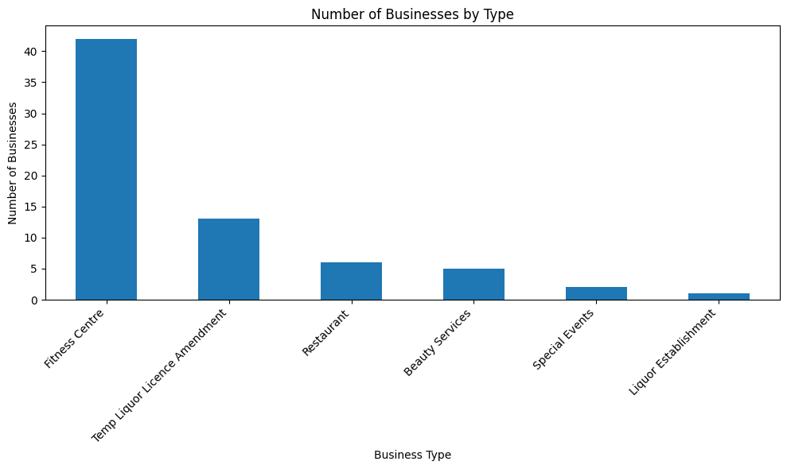
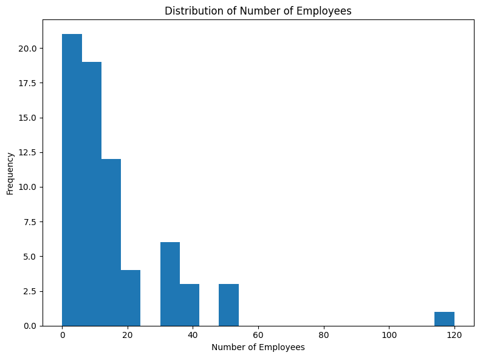
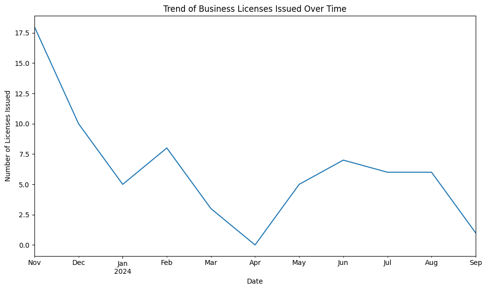

---
jupyter:
  colab:
  kernelspec:
    display_name: Python 3
    name: python3
  language_info:
    name: python
  nbformat: 4
  nbformat_minor: 0
---


::: {.cell .code execution_count="1" colab="{\"base_uri\":\"https://localhost:8080/\",\"height\":446}" id="4Hp0mcfZ7jw8" outputId="0c2577b4-eb5f-4324-8345-b509af14838b"}
``` python
import pandas as pd

# Load the dataset using semicolon as the delimiter
file_path = 'business-licences.csv'
business_data_cleaned = pd.read_csv(file_path, delimiter=';')

# Display the first few rows of the cleaned dataset to understand its structure
business_data_cleaned.head()
```

::: {.output .execute_result execution_count="1"}
``` json
{"type":"dataframe","variable_name":"business_data_cleaned"}
```
:::
:::

::: {.cell .code execution_count="2" colab="{\"base_uri\":\"https://localhost:8080/\",\"height\":617}" id="ofArVamF79nX" outputId="6cdfb6f2-beed-4b21-b3d4-d60edd86db01"}
``` python
# Check for missing values in the dataset
missing_values = business_data_cleaned.isnull().sum()

# Display the columns with missing values and the count
missing_values[missing_values > 0]
```

::: {.output .execute_result execution_count="2"}
```{=html}
<div>
<style scoped>
    .dataframe tbody tr th:only-of-type {
        vertical-align: middle;
    }

    .dataframe tbody tr th {
        vertical-align: top;
    }

    .dataframe thead th {
        text-align: right;
    }
</style>
<table border="1" class="dataframe">
  <thead>
    <tr style="text-align: right;">
      <th></th>
      <th>0</th>
    </tr>
  </thead>
  <tbody>
    <tr>
      <th>BusinessName</th>
      <td>4180</td>
    </tr>
    <tr>
      <th>BusinessTradeName</th>
      <td>37826</td>
    </tr>
    <tr>
      <th>IssuedDate</th>
      <td>3851</td>
    </tr>
    <tr>
      <th>ExpiredDate</th>
      <td>3843</td>
    </tr>
    <tr>
      <th>BusinessSubType</th>
      <td>54720</td>
    </tr>
    <tr>
      <th>Unit</th>
      <td>45608</td>
    </tr>
    <tr>
      <th>UnitType</th>
      <td>45685</td>
    </tr>
    <tr>
      <th>House</th>
      <td>26911</td>
    </tr>
    <tr>
      <th>Street</th>
      <td>26907</td>
    </tr>
    <tr>
      <th>City</th>
      <td>12</td>
    </tr>
    <tr>
      <th>Province</th>
      <td>19</td>
    </tr>
    <tr>
      <th>Country</th>
      <td>8760</td>
    </tr>
    <tr>
      <th>PostalCode</th>
      <td>27212</td>
    </tr>
    <tr>
      <th>LocalArea</th>
      <td>2584</td>
    </tr>
    <tr>
      <th>FeePaid</th>
      <td>52428</td>
    </tr>
    <tr>
      <th>Geom</th>
      <td>29589</td>
    </tr>
    <tr>
      <th>geo_point_2d</th>
      <td>29589</td>
    </tr>
  </tbody>
</table>
</div><br><label><b>dtype:</b> int64</label>
```
:::
:::

::: {.cell .code execution_count="3" colab="{\"base_uri\":\"https://localhost:8080/\"}" id="xCDm1XHN7-1v" outputId="4be09fe8-6a8f-48b2-8267-aca8dca838d5"}
``` python
# Drop rows with any missing values
business_data_dropped_na = business_data_cleaned.dropna()

# Display the shape of the new dataset to see how many rows remain
business_data_dropped_na.shape
```

::: {.output .execute_result execution_count="3"}
    (69, 25)
:::
:::

::: {.cell .code execution_count="4" colab="{\"base_uri\":\"https://localhost:8080/\",\"height\":293}" id="WdLIciqh8CAU" outputId="0e0b32b9-e2b8-4022-a582-6a68d3407b30"}
``` python
# Select relevant columns for business analysis
columns_of_interest = ['BusinessName', 'BusinessTradeName', 'BusinessType', 'IssuedDate', 'ExpiredDate', 'City', 'Province', 'PostalCode', 'LocalArea', 'NumberofEmployees']

# Create a new DataFrame with only the selected columns
business_data_filtered = business_data_dropped_na[columns_of_interest]

# Display the first few rows of the filtered dataset
business_data_filtered.head()
```

::: {.output .execute_result execution_count="4"}
``` json
{"repr_error":"0","type":"dataframe","variable_name":"business_data_filtered"}
```
:::
:::

::: {.cell .code execution_count="5" colab="{\"base_uri\":\"https://localhost:8080/\",\"height\":606}" id="_q08vP6Z8D9T" outputId="876e5d68-e31a-43b6-d23b-3c24a65bfc5e"}
``` python
# Convert 'IssuedDate' and 'ExpiredDate' to datetime format
business_data_filtered['IssuedDate'] = pd.to_datetime(business_data_filtered['IssuedDate'])
business_data_filtered['ExpiredDate'] = pd.to_datetime(business_data_filtered['ExpiredDate'])

# Check if the conversion was successful
business_data_filtered.dtypes
```

::: {.output .stream .stderr}
    <ipython-input-5-b2318db98025>:2: SettingWithCopyWarning: 
    A value is trying to be set on a copy of a slice from a DataFrame.
    Try using .loc[row_indexer,col_indexer] = value instead

    See the caveats in the documentation: https://pandas.pydata.org/pandas-docs/stable/user_guide/indexing.html#returning-a-view-versus-a-copy
      business_data_filtered['IssuedDate'] = pd.to_datetime(business_data_filtered['IssuedDate'])
    <ipython-input-5-b2318db98025>:3: SettingWithCopyWarning: 
    A value is trying to be set on a copy of a slice from a DataFrame.
    Try using .loc[row_indexer,col_indexer] = value instead

    See the caveats in the documentation: https://pandas.pydata.org/pandas-docs/stable/user_guide/indexing.html#returning-a-view-versus-a-copy
      business_data_filtered['ExpiredDate'] = pd.to_datetime(business_data_filtered['ExpiredDate'])
:::

::: {.output .execute_result execution_count="5"}
```{=html}
<div>
<style scoped>
    .dataframe tbody tr th:only-of-type {
        vertical-align: middle;
    }

    .dataframe tbody tr th {
        vertical-align: top;
    }

    .dataframe thead th {
        text-align: right;
    }
</style>
<table border="1" class="dataframe">
  <thead>
    <tr style="text-align: right;">
      <th></th>
      <th>0</th>
    </tr>
  </thead>
  <tbody>
    <tr>
      <th>BusinessName</th>
      <td>object</td>
    </tr>
    <tr>
      <th>BusinessTradeName</th>
      <td>object</td>
    </tr>
    <tr>
      <th>BusinessType</th>
      <td>object</td>
    </tr>
    <tr>
      <th>IssuedDate</th>
      <td>datetime64[ns, UTC+05:30]</td>
    </tr>
    <tr>
      <th>ExpiredDate</th>
      <td>datetime64[ns]</td>
    </tr>
    <tr>
      <th>City</th>
      <td>object</td>
    </tr>
    <tr>
      <th>Province</th>
      <td>object</td>
    </tr>
    <tr>
      <th>PostalCode</th>
      <td>object</td>
    </tr>
    <tr>
      <th>LocalArea</th>
      <td>object</td>
    </tr>
    <tr>
      <th>NumberofEmployees</th>
      <td>float64</td>
    </tr>
  </tbody>
</table>
</div><br><label><b>dtype:</b> object</label>
```
:::
:::

::: {.cell .code execution_count="6" colab="{\"base_uri\":\"https://localhost:8080/\",\"height\":300}" id="jW8RDNf58K_d" outputId="70be720b-e746-4d66-8dca-4455fe4ff5b7"}
``` python
# Generate summary statistics for numerical columns
business_data_filtered.describe()
```

::: {.output .execute_result execution_count="6"}
``` json
{"summary":"{\n  \"name\": \"business_data_filtered\",\n  \"rows\": 8,\n  \"fields\": [\n    {\n      \"column\": \"ExpiredDate\",\n      \"properties\": {\n        \"dtype\": \"date\",\n        \"min\": \"1970-01-01 00:00:00.000000069\",\n        \"max\": \"2024-12-31 00:00:00\",\n        \"num_unique_values\": 4,\n        \"samples\": [\n          \"2024-12-07 22:15:39.130434816\",\n          \"2024-12-31 00:00:00\",\n          \"69\"\n        ],\n        \"semantic_type\": \"\",\n        \"description\": \"\"\n      }\n    },\n    {\n      \"column\": \"NumberofEmployees\",\n      \"properties\": {\n        \"dtype\": \"number\",\n        \"std\": 41.58944712708599,\n        \"min\": 0.0,\n        \"max\": 120.0,\n        \"num_unique_values\": 8,\n        \"samples\": [\n          15.014492753623188,\n          17.0,\n          69.0\n        ],\n        \"semantic_type\": \"\",\n        \"description\": \"\"\n      }\n    }\n  ]\n}","type":"dataframe"}
```
:::
:::

::: {.cell .code execution_count="7" colab="{\"base_uri\":\"https://localhost:8080/\",\"height\":304}" id="qCU2YW738My_" outputId="5e010c4c-6eb9-4aac-d7b6-48e93da61510"}
``` python
# Count the number of businesses by their type
business_count_by_type = business_data_filtered['BusinessType'].value_counts()

# Display the count of businesses by type
business_count_by_type
```

::: {.output .execute_result execution_count="7"}
```{=html}
<div>
<style scoped>
    .dataframe tbody tr th:only-of-type {
        vertical-align: middle;
    }

    .dataframe tbody tr th {
        vertical-align: top;
    }

    .dataframe thead th {
        text-align: right;
    }
</style>
<table border="1" class="dataframe">
  <thead>
    <tr style="text-align: right;">
      <th></th>
      <th>count</th>
    </tr>
    <tr>
      <th>BusinessType</th>
      <th></th>
    </tr>
  </thead>
  <tbody>
    <tr>
      <th>Fitness Centre</th>
      <td>42</td>
    </tr>
    <tr>
      <th>Temp Liquor Licence Amendment</th>
      <td>13</td>
    </tr>
    <tr>
      <th>Restaurant</th>
      <td>6</td>
    </tr>
    <tr>
      <th>Beauty Services</th>
      <td>5</td>
    </tr>
    <tr>
      <th>Special Events</th>
      <td>2</td>
    </tr>
    <tr>
      <th>Liquor Establishment</th>
      <td>1</td>
    </tr>
  </tbody>
</table>
</div><br><label><b>dtype:</b> int64</label>
```
:::
:::

::: {.cell .code execution_count="8" colab="{\"base_uri\":\"https://localhost:8080/\",\"height\":607}" id="LgRLI-qo8OUv" outputId="042240d5-1e79-4594-cff6-a3014208f8b4"}
``` python
import matplotlib.pyplot as plt

# Plot the distribution of businesses by their type
plt.figure(figsize=(10, 6))
business_count_by_type.plot(kind='bar')
plt.title('Number of Businesses by Type')
plt.xlabel('Business Type')
plt.ylabel('Number of Businesses')
plt.xticks(rotation=45, ha='right')
plt.tight_layout()
plt.show()
```

::: {.output .display_data}

:::
:::

::: {.cell .code execution_count="9" colab="{\"base_uri\":\"https://localhost:8080/\",\"height\":607}" id="-M2_Jhop8Qxf" outputId="5721d710-f3c4-4edd-f5b8-665746af534c"}
``` python
# Plot the distribution of the number of employees
plt.figure(figsize=(8, 6))
business_data_filtered['NumberofEmployees'].plot(kind='hist', bins=20)
plt.title('Distribution of Number of Employees')
plt.xlabel('Number of Employees')
plt.ylabel('Frequency')
plt.tight_layout()
plt.show()
```

::: {.output .display_data}

:::
:::

::: {.cell .code execution_count="10" colab="{\"base_uri\":\"https://localhost:8080/\",\"height\":607}" id="GHCCjd2l8TYd" outputId="a3199a24-6a04-490e-fa4f-7f570c445abb"}
``` python
# Create a time series of the number of businesses issued over time
business_data_filtered.set_index('IssuedDate', inplace=True)

# Resample by month to see the trend over time
business_trend_over_time = business_data_filtered.resample('M').size()

# Plot the time trend of issued licenses
plt.figure(figsize=(10, 6))
business_trend_over_time.plot()
plt.title('Trend of Business Licenses Issued Over Time')
plt.xlabel('Date')
plt.ylabel('Number of Licenses Issued')
plt.tight_layout()
plt.show()
```

::: {.output .display_data}

:::
:::
