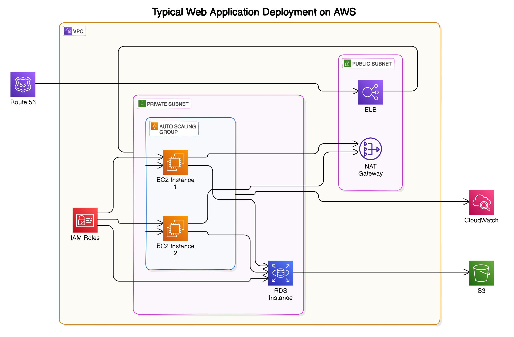

---
jupyter:
  colab:
    kernelspec:
      display_name: Python 3
      name: python3
    language_info:
      name: python
  nbformat: 4
  nbformat_minor: 0
---

# AWS Cloud Architecture Diagram



In modern cloud computing, designing a robust, scalable, and secure architecture is essential for deploying any application. The AWS cloud architecture diagram provided here shows a typical design pattern used in building cloud-native applications. It includes components such as EC2 instances, Elastic Load Balancers, and S3 storage, all of which are essential to achieving a high degree of availability, scalability, and security in the cloud.

## Data Analysis on Business Licences

Data analysis is the process of inspecting, cleansing, and modeling data to discover useful information, inform conclusions, and support decision-making. In this project, we will analyze a dataset of business licenses, which provides key information about various businesses in a specific area, such as their type, issuance date, number of employees, and other details. This kind of analysis can help city planners, regulators, and business owners understand market trends and operational dynamics.

### Cell 1: Load and clean the dataset

```python
import pandas as pd

# Load the dataset using semicolon as the delimiter
file_path = 'business-licences.csv'
business_data_cleaned = pd.read_csv(file_path, delimiter=';')

# Display the first few rows of the cleaned dataset to understand its structure
business_data_cleaned.head()
```

In this step, we load the dataset using the `pandas` library, a powerful tool for data manipulation and analysis in Python. The dataset is a CSV file containing business licenses, but it uses a semicolon as a delimiter instead of the more common comma. The `pd.read_csv()` function allows us to specify this delimiter and load the data properly.

### Cell 2: Check for missing values

```python
# Check for missing values in the dataset
missing_values = business_data_cleaned.isnull().sum()

# Display the columns with missing values and the count
missing_values[missing_values > 0]
```

After loading the data, the next critical step is to check for missing values. Missing values can cause errors in analysis or lead to inaccurate conclusions. By using the `isnull()` function in `pandas`, we can identify which columns have missing data and how many values are missing. This helps us decide how to handle the missing data, whether through deletion or imputation.

### Output 2

```json
{
  "BusinessName": 4180,
  "BusinessTradeName": 37826,
  "IssuedDate": 3851,
  "ExpiredDate": 3843,
  "BusinessSubType": 54720,
  "Unit": 45608,
  "UnitType": 45685,
  "House": 26911,
  "Street": 26907,
  "City": 12,
  "Province": 19,
  "Country": 8760,
  "PostalCode": 27212,
  "LocalArea": 2584,
  "FeePaid": 52428,
  "Geom": 29589,
  "geo_point_2d": 29589
}
```

The output shows the number of missing values for each column. For example, `BusinessName` has 4180 missing values, and `BusinessTradeName` has 37,826 missing values. Depending on the significance of these columns, we may choose to drop rows or fill in missing values based on business logic.

### Cell 3: Drop rows with missing values

```python
# Drop rows with any missing values
business_data_dropped_na = business_data_cleaned.dropna()

# Display the shape of the new dataset to see how many rows remain
business_data_dropped_na.shape
```

To ensure that our analysis is based on complete and accurate data, we can remove rows with missing values using the `dropna()` function. While this reduces the number of rows in our dataset, it eliminates potential inaccuracies that could arise from incomplete data. However, it is essential to evaluate the impact of dropping rows—if too much data is removed, we may need to consider alternative approaches like filling missing values.

### Output 3

```
(69, 25)
```

Here, we see that after dropping rows with missing data, we are left with 69 rows and 25 columns. This tells us that a significant portion of the data was incomplete, and we should proceed carefully in the next steps.

### Cell 4: Select relevant columns for business analysis

```python
# Select relevant columns for business analysis
columns_of_interest = ['BusinessName', 'BusinessTradeName', 'BusinessType', 'IssuedDate', 'ExpiredDate', 'City', 'Province', 'PostalCode', 'LocalArea', 'NumberofEmployees']

# Create a new DataFrame with only the selected columns
business_data_filtered = business_data_dropped_na[columns_of_interest]

# Display the first few rows of the filtered dataset
business_data_filtered.head()
```

Not all columns in a dataset are necessarily useful for every analysis. In this step, we extract the most relevant columns for our specific analysis: business names, types, dates of issuance and expiration, location details, and the number of employees. By focusing on the most important columns, we streamline our dataset for further analysis.

### Cell 5: Convert 'IssuedDate' and 'ExpiredDate' to datetime format

```python
# Convert 'IssuedDate' and 'ExpiredDate' to datetime format
business_data_filtered['IssuedDate'] = pd.to_datetime(business_data_filtered['IssuedDate'])
business_data_filtered['ExpiredDate'] = pd.to_datetime(business_data_filtered['ExpiredDate'])

# Check if the conversion was successful
business_data_filtered.dtypes
```

For proper time series analysis and other operations, it is crucial to convert date columns to the correct `datetime` format. This allows us to perform date-based filtering, resampling, and trend analysis. The `pd.to_datetime()` function converts the strings in the date columns to datetime objects that can be manipulated in various ways.

### Cell 6: Summary statistics for numerical columns

```python
# Generate summary statistics for numerical columns
business_data_filtered.describe()
```

In this step, we generate summary statistics for the numerical columns in the dataset. This includes measures like the mean, standard deviation, minimum, and maximum values. Summary statistics provide a quick overview of the data and can help identify potential outliers or trends.

### Cell 7: Count the number of businesses by type

```python
# Count the number of businesses by their type
business_count_by_type = business_data_filtered['BusinessType'].value_counts()

# Display the count of businesses by type
business_count_by_type
```

Understanding the distribution of business types is important for market analysis. For instance, knowing which sectors have the most businesses can provide insights into the local economy and identify areas of growth or decline. The `value_counts()` function helps us determine how many businesses fall into each type category.

### Cell 8: Plot the distribution of businesses by their type

```python
import matplotlib.pyplot as plt

# Plot the distribution of businesses by their type
plt.figure(figsize=(10, 6))
business_count_by_type.plot(kind='bar')
plt.title('Number of Businesses by Type')
plt.xlabel('Business Type')
plt.ylabel('Number of Businesses')
plt.xticks(rotation=45, ha='right')
plt.tight_layout()
plt.show()
```

### Output 8


Visualization is key to understanding data distributions. Here, a bar chart is used to show the number of businesses in each type. This visual representation allows us to quickly see which business types dominate and where there might be gaps or opportunities for growth.

### Cell 9: Plot the distribution of the number of employees

```python
# Plot the distribution of the number of employees
plt.figure(figsize=(8, 6))
business_data_filtered['NumberofEmployees'].plot(kind='hist', bins=20)
plt.title('Distribution of Number of Employees')
plt.xlabel('Number of Employees')
plt.ylabel('Frequency')
plt.tight_layout()
plt.show()
```

### Output 9


In addition to understanding the types of businesses, it is valuable to analyze the size of businesses by the number of employees. This histogram provides insight into the employee distribution across businesses. For example, we can see whether most businesses are small (few employees) or if there are many large employers in the dataset.

### Cell 10: Time trend of issued licenses

```python
# Create a time series of the number of businesses issued over time
business_data_filtered.set_index('IssuedDate', inplace=True)

# Resample by month to see the trend over time
business_trend_over_time = business_data_filtered.resample('M').size()

# Plot the time trend of issued licenses
plt.figure(figsize=(10, 6))
business_trend_over_time.plot()
plt.title('Trend of Business Licenses Issued Over Time')
plt.xlabel('Date')
plt.ylabel('Number of Licenses Issued
```markdown
')
plt.tight_layout()
plt.show()
```

### Output 10


### Explanation of the Time Trend Analysis

Time series analysis is a powerful method used to detect trends, seasonality, and patterns over time. In this case, we are analyzing the issuance of business licenses over a period. By setting the `IssuedDate` as the index and resampling the data by month, we can track how the number of business licenses issued fluctuates over time.

This type of analysis is particularly useful for identifying peaks and troughs in business activity. For instance, if there is a consistent surge in licenses during certain months (e.g., during the holiday season or at the start of a fiscal year), it might indicate when businesses are more likely to start operating or expand. On the other hand, sudden drops may be linked to external factors such as economic downturns, regulatory changes, or unforeseen events like pandemics.

The resampling is done using the `.resample('M')` function, which aggregates the data into monthly bins. This allows us to create a smooth time series that can help in identifying long-term trends rather than focusing on daily fluctuations, which might obscure the bigger picture.

By plotting this trend, business analysts and city planners can make informed decisions about economic planning, policy adjustments, or resource allocation. For example, if a consistent increase in licenses is observed, the city might want to allocate more resources toward business support services, infrastructure, or workforce development programs. Conversely, if a decline is noted, it may prompt investigations into the underlying causes, such as economic challenges or a less favorable business environment.

### Conclusion

In this analysis, we have gone through a systematic process to analyze a dataset containing information about business licenses. By using Python and the `pandas` library, we have:
- Loaded and cleaned the data.
- Investigated missing values and handled them appropriately.
- Narrowed the dataset to relevant columns for analysis.
- Explored business distributions based on type, number of employees, and issuance dates.
- Visualized the distribution of business types and the employee count.
- Conducted a time-series analysis of license issuance to uncover trends over time.

Through this approach, we have demonstrated how effective data analysis techniques can yield valuable insights. These insights can inform strategic decisions, policy-making, and economic planning. Moreover, the tools used here, such as `pandas` for data manipulation and `matplotlib` for visualization, are essential for any data scientist or business analyst working with real-world datasets.

### Potential Future Work

1. **Predictive Modeling**: Based on the time-series data, predictive models (such as ARIMA or Prophet) could be used to forecast future trends in business license issuance. This would enable proactive planning and resource allocation.
2. **Correlation Analysis**: Further analysis could explore correlations between business success and factors such as location (city or local area), type of business, or the number of employees. This could provide deeper insights into what makes businesses more likely to thrive in certain areas or sectors.
3. **Geospatial Analysis**: By using the geographical data (latitude and longitude), we could map business density across the region, identifying hotspots and underdeveloped areas. Geospatial tools such as `GeoPandas` could be integrated to perform such an analysis.

Incorporating these additional analyses would further enhance our understanding of the business landscape, enabling more data-driven decisions to support economic growth and development.


Certainly! Here's an extended markdown explanation that incorporates elements of a business licenses case study, with additional theory and practical application to each component of the data analysis project:


# Deliverables

The deliverables outlined below form the foundation of a comprehensive data analytics project, using AWS services to manage, clean, and process business license data. This framework ensures that the data is secure, reliable, and available for detailed analysis and decision-making. The context is based on a **business licenses case study**, where data related to business permits issued over a period of time is analyzed to extract trends, insights, and patterns that can inform both regulatory bodies and businesses themselves.

## 1. Data Questions and Discovery

In any data-driven project, the first step is identifying the **key questions** you aim to answer. In the context of a **business licenses case study**, these questions might include:
- How many new business licenses were issued in the past year?
- What types of businesses are experiencing the most growth?
- Are there geographical hotspots where business activity is concentrated?
- How has the issuance of licenses fluctuated seasonally or annually?
- Is there a correlation between the type of business and the number of employees?

The **data discovery** phase helps you to understand what information is available and how it can be used to answer these questions. This involves inspecting the datasets, evaluating their structure, and identifying key variables. In this case, data may include fields such as business type, date of license issuance, number of employees, and geographical location.

During discovery, **interactive tools** like **Amazon Athena** can be employed to run exploratory queries on the data stored in S3, without needing to move or transform it. This provides a quick way to understand the scope of the available data, find missing values, or detect anomalies that need to be addressed before deeper analysis.

## 2. S3 Storage Structure

When dealing with data such as **business licenses**, which can span multiple years and involve different regions or types of businesses, organizing your data in **Amazon S3** efficiently is crucial. In this case study, you may store your data based on year, region, or business type.

For example:
```
s3://business-licenses-data/
    ├── 2023/
    │   ├── retail/
    │   ├── services/
    │   └── manufacturing/
    ├── 2024/
    │   ├── retail/
    │   ├── services/
    │   └── manufacturing/
```

This hierarchical **S3 storage structure** not only helps in managing the data more efficiently but also improves the performance of queries. For instance, if you are interested in analyzing the **retail sector licenses** in 2023, the data can be easily accessed from the appropriate folder without scanning the entire dataset. Additionally, features like **S3 Lifecycle Rules** can help automatically transition older data to cheaper storage tiers (e.g., S3 Glacier) or archive it, ensuring that costs are kept low while keeping historical data available for future analysis.

## 3. Cleaned Datasets for 2023 and 2024

The data in business license records may come from various sources—government databases, manual submissions, and more. These raw datasets often contain missing values, duplicates, and inconsistent formats. Before performing any meaningful analysis, **cleaning** this data is essential to ensure accuracy.

For this business licenses case study, the cleaning process involves:
- **Removing duplicates**: For instance, a business may have mistakenly submitted more than one application for a license, which would skew the number of new licenses issued.
- **Filling missing values**: In cases where key information like the number of employees or business type is missing, imputing reasonable values or removing those records is critical to prevent bias in the analysis.
- **Standardizing data types**: Dates should be standardized to allow for accurate time-series analysis. Similarly, categorical data like business types should be consistent (e.g., "Restaurant" vs. "restaurant").

**AWS Glue** can automate much of this process by running **ETL (Extract, Transform, Load)** jobs that clean the data. In this context, AWS Glue could be used to process business license data for the years 2023 and 2024, ensuring that the cleaned datasets are reliable for further use in analytics. Clean data allows for more accurate trend detection, forecasting, and decision-making.

## 4. ETL Pipeline Design and Implementation (AWS Glue)

In any data project, including a **business licenses case study**, creating an **ETL (Extract, Transform, Load)** pipeline ensures that data flows smoothly from its raw state to a format ready for analysis. The design of this pipeline is crucial for handling large-scale data ingestion, processing, and loading in an automated, efficient manner.

### Extract
In this case, the extraction process might pull raw business license data from multiple sources: databases, manual entries, or other government repositories. **AWS Glue** simplifies this by connecting to these sources and automatically pulling data into a central location—typically S3.

### Transform
Once extracted, the data needs to be transformed. In the case study, this might involve:
- **Converting all dates** to a standardized format for easier time-based analysis.
- **Normalizing business types**: For example, some records might list a business as "Restaurant" while others use "Dining Establishment." These need to be standardized to avoid fragmentation in the analysis.
- **Deriving new features**: For instance, you could calculate the **duration a business license is valid** by subtracting the issuance date from the expiration date.

### Load
After transformation, the cleaned and structured data is loaded back into an S3 bucket or a **data warehouse** like **Amazon Redshift** for querying. The output of this ETL pipeline can then be used for analysis or reporting, ensuring that the insights drawn are based on accurate and up-to-date information.

The ETL process in AWS Glue is fully managed and serverless, meaning no infrastructure is required. This makes it a flexible solution for organizations looking to automate their data pipelines without worrying about underlying resources.

## 5. Structured SQL Queries in AWS Athena

Once the data is cleaned and organized, the next step is to begin querying the data to answer the key business questions posed at the beginning of the project. **Amazon Athena** allows you to run SQL queries directly on your data in S3 without needing to move it to a database. This makes it an ideal tool for ad-hoc queries and exploratory data analysis.

For instance, you could run queries like:
```sql
SELECT COUNT(*) 
FROM business_licenses 
WHERE business_type = 'Retail' 
AND year(issued_date) = 2023;
```
This query would return the total number of retail business licenses issued in 2023. Athena’s integration with S3 means that even very large datasets (e.g., several years of business licenses) can be queried efficiently using SQL, which is familiar to most data analysts.

In the business licenses case study, Athena could be used to explore trends across different business sectors, analyze the issuance rates across years, and compare geographical regions for business activity. The flexibility of Athena enables rapid insights without the overhead of managing a database.

## 6. Visualizations (Charts in MS Excel)

After querying and aggregating the data, the next step is to present the insights in a visually comprehensible format. **Data visualization** is a powerful way to communicate patterns, trends, and outliers to both technical and non-technical stakeholders. **MS Excel** is a versatile tool for generating charts, and although other tools like **Tableau** or **AWS QuickSight** can offer more advanced features, Excel remains widely accessible and effective.

For this case study on business licenses, Excel could be used to create:
- **Bar charts** showing the number of licenses issued by business type for each year.
- **Line charts** illustrating trends in license issuance over time, helping to identify peak periods of business activity.
- **Pie charts** displaying the proportion of business licenses issued across different regions or sectors.

For example, a bar chart comparing the number of **retail licenses** versus **service licenses** over the past five years can quickly reveal whether certain sectors are growing faster than others, providing insights into economic trends and business dynamics within the region.

## 7. Data Published on General and Web Servers (EC2 Instances)

Once the data has been processed, cleaned, and analyzed, it’s important to make it available to relevant stakeholders, whether that’s through a web application, API, or reporting interface. **Amazon EC2 (Elastic Compute Cloud)** provides a scalable platform to host web servers where this data can be published.

For example, in this business licenses case study, an EC2 instance might host a **dashboard** where users (e.g., government officials, business owners) can log in and view trends in license issuance. The data could be refreshed periodically by the ETL pipeline to ensure the information is up-to-date. By using EC2 instances, the system can scale to accommodate varying loads (e.g., more users accessing the dashboard during the tax season) while ensuring consistent performance.

## 8. Data Protection (AWS KMS Encryption)

When dealing with sensitive data, such as business licenses that may contain personal or business information, **data protection** is a top priority. **AWS KMS (Key Management Service)** provides a centralized way to manage encryption keys that secure data at rest and in transit.

In this case study, KMS could be used to encrypt sensitive data, ensuring that only authorized users can access it. For example, a government agency might use KMS to encrypt business license records stored in S3, making sure that even if the data is accidentally exposed, it remains unreadable to unauthorized parties. The **KMS integration with S3, RDS, and other AWS services** ensures that encryption is applied automatically across the entire data pipeline, from storage to processing.


## 9. S3 Versioning for Data History

**Amazon S3 Versioning** is an essential feature that allows multiple versions of an object (file) to be stored in a bucket. This is particularly useful when maintaining **data history**, as it ensures that older versions of a dataset can be recovered if necessary.

In the context of the **business licenses case study**, versioning plays a crucial role. For instance, business license data can change over time, such as updates to business names, number of employees, or changes in the business category. By enabling versioning on the S3 bucket where business license data is stored, any accidental overwrites, deletions, or updates can be undone. For example:
- If a dataset for the year 2023 is updated with a correction to a business's license information, the old version of the file will still be available in case any rollback is needed.
- This also supports compliance and auditing requirements, where historical records may need to be reviewed. If a dispute arises about the accuracy of a business's licensing data, having access to older versions can help resolve the issue.

S3 Versioning, combined with **Lifecycle Policies**, allows businesses to archive older versions to **S3 Glacier** for cost-effective long-term storage. This ensures that the data history is maintained without significantly increasing costs, while also meeting regulatory and compliance standards. 

Versioning is also valuable for recovering from unintended changes or malicious actions (such as accidental deletions or ransomware attacks), providing an additional layer of data protection and reliability in your data pipeline.

## 10. Cross-Region Replication for Data Availability

**Cross-Region Replication (CRR)** is a powerful feature of Amazon S3 that automatically copies data from one AWS region to another. In a **business licenses case study**, ensuring **data availability** is crucial, especially when the data is accessed by multiple stakeholders spread across different geographical regions or if the system must continue operating during regional outages.

For example, if the primary region where business license data is stored experiences a natural disaster or other failures, having that data replicated in another region ensures that users and systems can continue to access the data with minimal disruption. This is especially important for:
- **Disaster Recovery**: If an entire AWS region goes offline, the replicated data in another region ensures that the system remains operational. For government agencies and businesses relying on access to business license data, any downtime can be costly or disruptive to operations.
- **Latency Optimization**: By replicating the data to regions closer to users, CRR can help reduce latency for accessing business license information. For instance, if a region's business owners need to access licensing data frequently, having a replica of the data in a geographically closer AWS region reduces access times and enhances user experience.
- **Compliance**: In some cases, data must be stored in specific regions due to data sovereignty laws. Cross-region replication allows you to comply with these regulations while maintaining a single point of control for managing your data.

CRR automatically keeps the replicated data in sync with the source region, meaning any new business licenses, updates, or changes to the dataset are reflected in the replicated region almost immediately. This ensures high **data availability** and resilience, which is critical for any business or government service that relies on continuous access to accurate, up-to-date data.

---

## Conclusion

In this **business licenses case study**, we have outlined a comprehensive data analytics framework leveraging AWS services to manage, clean, analyze, and secure business license data. Each deliverable plays a critical role in ensuring that the data is handled efficiently, made available for analysis, and protected against loss or corruption. 

### Key Takeaways:

1. **Data Questions and Discovery**: By formulating the right questions, we ensure that the data analysis efforts are aligned with business objectives—whether that’s tracking growth trends in business activity or identifying regional hotspots for new businesses.

2. **S3 Storage Structure**: A well-organized storage structure ensures that data is easy to access, query, and manage, while also optimizing costs through lifecycle management policies.

3. **Data Cleaning**: Cleaned datasets ensure that the analysis is based on accurate and reliable information, removing the noise from raw data.

4. **ETL Pipeline**: An automated pipeline using AWS Glue ensures that raw data is consistently transformed and made available for analysis without manual intervention, speeding up insights generation.

5. **SQL Queries in Athena**: Using Amazon Athena for structured SQL queries allows for interactive, cost-efficient analysis of large datasets without the need to set up dedicated database infrastructure.

6. **Visualizations**: Visualizing the business license data helps stakeholders quickly identify trends, patterns, and outliers, enabling better decision-making at both operational and strategic levels.

7. **Data Publication**: Publishing data via EC2 web servers ensures that key insights are accessible to stakeholders in real time, facilitating transparency and collaboration.

8. **Data Protection with KMS**: Security is paramount, especially for sensitive business data. AWS KMS encryption ensures that business license data is protected from unauthorized access while complying with data security standards.

9. **Versioning**: S3 versioning preserves the history of the data, allowing recovery from mistakes and enabling compliance with data retention policies.

10. **Cross-Region Replication**: CRR ensures high availability and redundancy, enabling access to business license data even in the event of regional AWS outages or disasters.

---

### Practical Business Implications:

For a city government or local business authority, this entire framework empowers data-driven decision-making. By analyzing business license data over time, city planners can:
- Identify emerging trends in business activity and allocate resources accordingly.
- Support economic growth by providing insights to investors or entrepreneurs looking to open new businesses.
- Improve public services by identifying areas with increasing business activity that may require additional infrastructure or zoning changes.

For businesses themselves, access to this kind of data analysis can:
- Reveal competitive trends in their industry, helping them make strategic decisions.
- Identify geographic areas with higher concentrations of certain business types, providing insights into market saturation or opportunities.
- Provide historical context on how business regulations or external factors (such as economic downturns) have affected business activity.

Ultimately, the combination of **AWS services** and structured data analytics provides both businesses and governments with the tools they need to make informed decisions that support long-term economic growth and operational efficiency. By ensuring data availability, security, and accessibility, AWS helps organizations harness the power of their data to drive better outcomes.

---

## Additional Areas for Future Work:

1. **Predictive Analytics**: Once a robust dataset is in place, machine learning models could be built to predict future business license issuance trends based on past data. For example, using AWS SageMaker, models could predict how many businesses will open in a given region over the next five years, or what factors correlate with higher business success rates.

2. **Real-Time Analytics**: Implementing real-time data pipelines using services like AWS Kinesis can help monitor and analyze business license applications as they are submitted. This could allow for more immediate insights into market conditions or business activity.

3. **Advanced Geospatial Analysis**: By integrating geospatial data with business license information, city planners could better understand how business activity is spread across geographic regions. Tools like **Amazon QuickSight** or **ArcGIS** could be used to create interactive maps showing where new businesses are opening and how that correlates with factors like population growth or transportation access.

4. **Integrating Third-Party Data**: Combining business license data with third-party datasets (e.g., economic indicators, demographic data, or social media sentiment analysis) could provide even deeper insights into what drives business success and how external factors impact local economies.

---

By leveraging the full suite of AWS services, this case study demonstrates how cloud technology can be used to analyze, manage, and secure large datasets, ultimately enabling more data-driven decision-making for both public and private entities.


